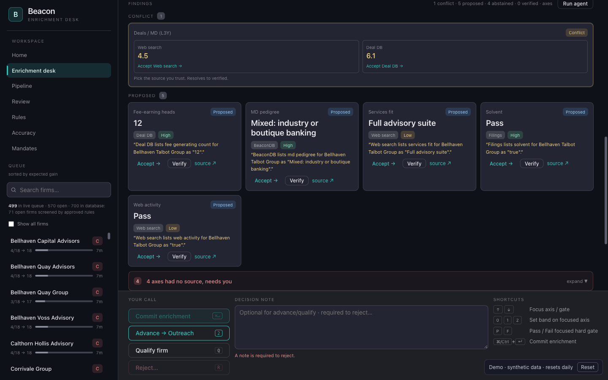
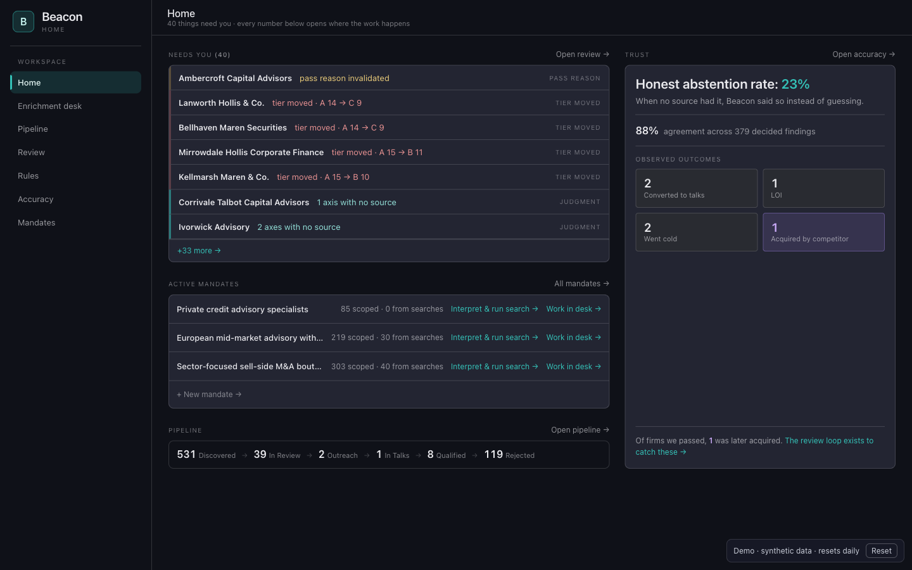
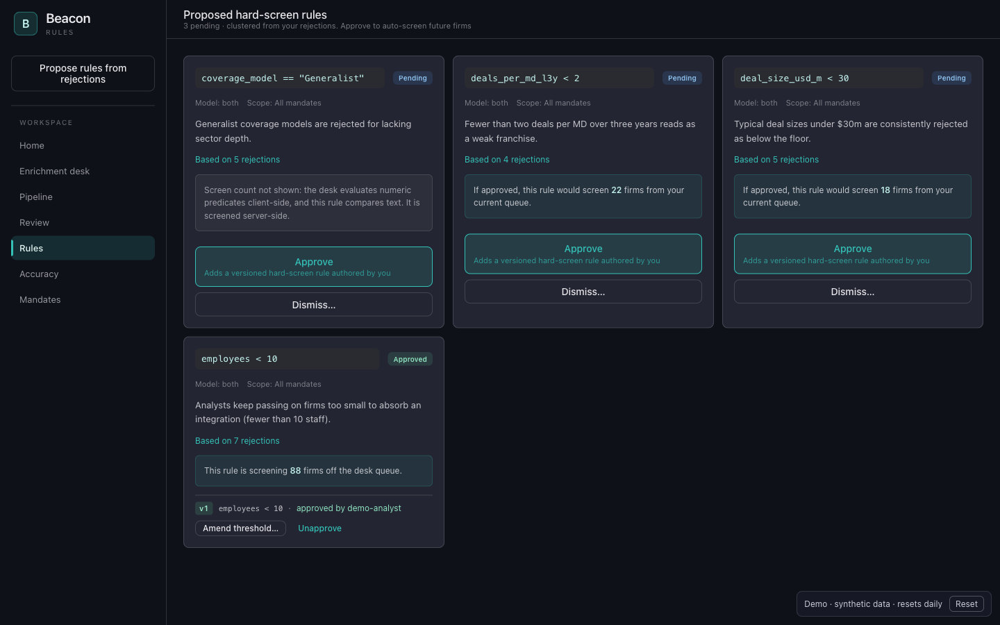
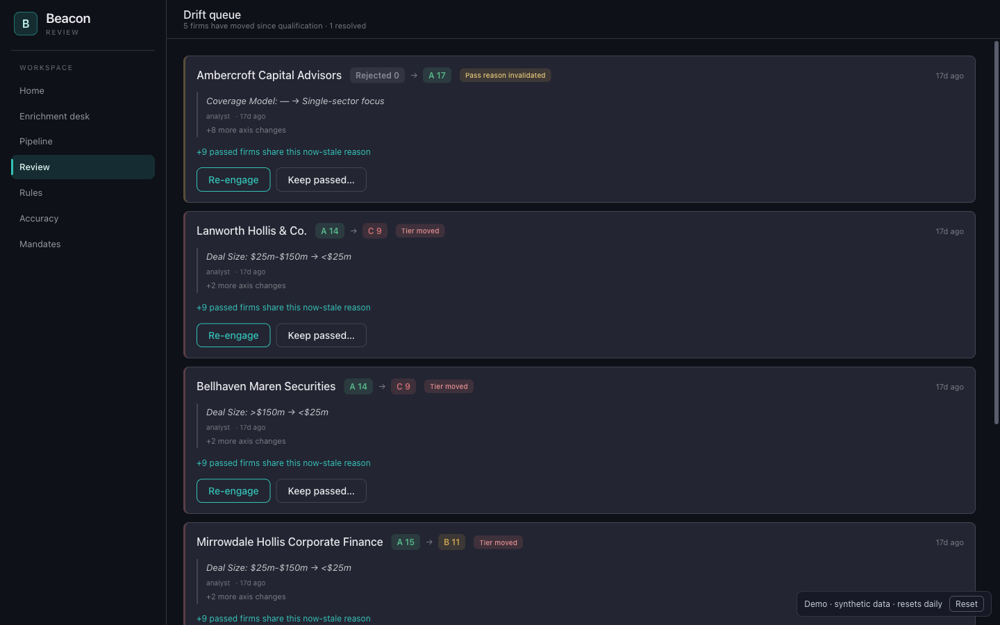
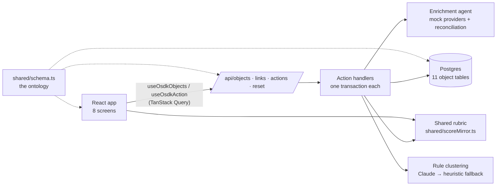

# Beacon

Acquisition-target sourcing for a corporate development team. Analysts turn a mandate into a searched universe of advisory firms. An agent assembles cited evidence for each firm, a deterministic rubric scores and tiers every firm, and the reasons analysts reject firms become proposed screening rules for the next search.

**Live demo:** https://beacon-tan-psi.vercel.app (synthetic data, resets daily)



## What it does

- **Mandate → search.** Scope a candidate universe by thesis (corporate finance or capital solutions), geography, product, and sector.
- **Agent enrichment with honest abstention.** Four mock data sources are queried in trust order. Agreement becomes one corroborated finding. Disagreement becomes an explicit conflict for the analyst. "No source has this" is recorded as an abstention instead of a guess.
- **Deterministic scoring.** An 18-point, nine-axis rubric per thesis, with hard rejects and A/B/C tiers. The same code runs in the browser for live previews and on the server for the record.
- **Append-only audit trail.** Scores, findings, and decisions are versioned, never edited.
- **A learning loop with a human in it.** Rejection rationales are clustered (by Claude, with a deterministic fallback) into proposed screening rules. Each proposal is checked against the data, shows how many firms it would screen, and only takes effect after an analyst approves it.
- **Drift.** When new evidence moves a qualified or passed firm's tier, or a passed firm is bought by a competitor, it resurfaces for review.

| Home | Rules | Review |
| --- | --- | --- |
|  |  |  |

## Architecture

See [docs/architecture.md](docs/architecture.md).



## Built on Palantir Foundry, then ported

Beacon was first built on Palantir Foundry (Ontology, Functions, Actions, AIP, OSDK). When that environment went away, the backend was rebuilt on an open stack behind the same frontend. [docs/foundry-origins.md](docs/foundry-origins.md) maps each Foundry concept to its replacement.

## Run it locally

Requires Node 22+.

```bash
npm install
npm run seed      # builds the demo world in .data/pglite (in-process Postgres)
npm run dev       # http://localhost:8080
```

`npm run check` runs the sanitization guard, lint, the formatting check, both typechecks, and the test suite.

Rule clustering uses a keyword heuristic by default. To use Claude, set `CLAUDE_CLUSTERING=on` and provide Anthropic credentials (`ANTHROPIC_API_KEY`). The public demo allows at most one Claude call per 10 minutes and 24 per day; everything else falls back to the heuristic.

## Project layout

| Path | What lives there |
| --- | --- |
| `shared/` | The ontology schema, rubric, vocabulary, taxonomy, predicates (used by both sides) |
| `server/actions/` | One module per domain; every write is a named, validated, transactional action |
| `server/enrichment/` | Deterministic mock providers and evidence reconciliation |
| `server/clustering/` | Claude and heuristic rule proposers |
| `server/seed/` | 700-firm synthetic universe and a history built by the real actions |
| `api/` | Vercel Functions: thin HTTP adapters |
| `src/` | The React app; `src/data/` is the typed data layer |

## Data

Everything is synthetic. Firm names are generated from invented words, and any resemblance to a real firm is coincidental. Enrichment sources are mocks that link to reserved `.example` domains.
