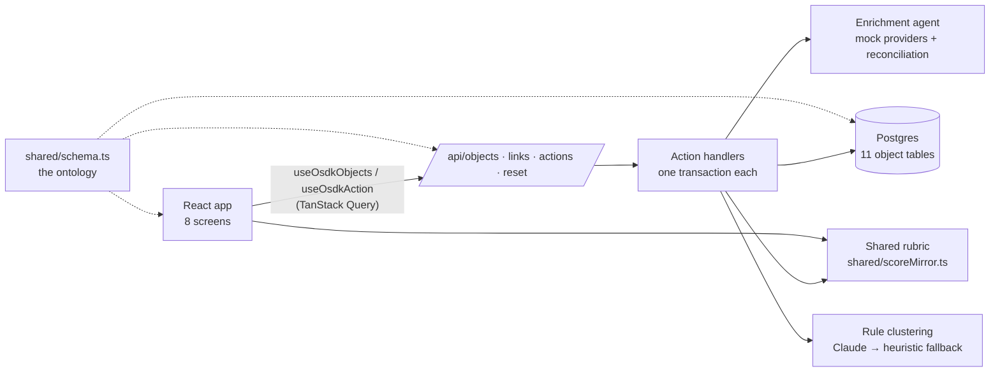

# Architecture

Beacon is a React app over a small TypeScript backend. One schema file describes the whole data model, every write goes through a named action, and the rubric is one module that both the browser and the server import.



## Ontology first

`shared/schema.ts` declares the 11 object types (firms, mandates, searches, findings, scores, decisions, drift events, rules, hard-screen configs, and the search join objects), their properties and types, the two links the UI traverses, and the 17 action names. Everything else derives from it:

- **Storage.** `server/db/ddl.ts` generates one Postgres table per object type, with quoted camelCase columns that match the property names.
- **Repository.** `server/db/repo.ts` reads and writes by object type. Every column name that reaches SQL is checked against the schema first, and every value is a bound parameter, so a request can't name a column that doesn't exist or inject SQL.
- **API.** `GET /api/objects` lists one type with `$eq` filters and ordering, `POST /api/links` follows a link for many source objects in one query, and `POST /api/actions` applies a named action.
- **Frontend.** `src/data/hooks.ts` exposes typed hooks keyed by the same type names. They keep the OSDK hook names the pages were written against, so the screens didn't change when the backend did.

Locally the database is PGlite (Postgres compiled to WebAssembly, persisted under `.data/`). In production it is Neon Postgres. The same SQL runs on both.

## Actions

Every write is an action in `server/actions/`, registered by name. Applying one:

1. Checks the demo's ceilings (activity tables, mandates, searches) so a single visitor can't fill the shared database.
2. Validates the parameters against the action's spec: types, lengths, list sizes, and object references. Referenced objects are loaded `FOR UPDATE`, so two concurrent actions on one firm run one after the other.
3. Runs the handler inside one transaction and returns the ids it created or modified, plus an optional note for the UI.

History is append-only. Qualification scores and review decisions are never updated. A research finding only ever changes its verification status, and an analyst override creates a new finding instead of editing the agent's. A drift event only changes its status and resolution.

## The enrichment agent

Each synthetic firm has a hidden true value per rubric axis. Four mock providers observe it, each covering a subset of axes with its own coverage and error rate:

| Provider | Trust | Coverage | Error rate |
| --- | --- | --- | --- |
| BeaconDB | 1 | 25% | 2% |
| Deal DB | 2 | 70% | 10% |
| Filings | 3 | 60% | 5% |
| Web search | 4 | 55% | 20% |

Observations are pure functions of provider, firm, and axis, so the agent is deterministic without a fixture table. `server/enrichment/reconcile.ts` turns one axis's observations into findings:

- **No observations → abstention.** The agent records that no source had the value instead of guessing. Abstention is a first-class outcome: it tells the analyst exactly where their judgment is needed, and the Accuracy page reports the abstention rate as a trust signal.
- **Agreement → one corroborated finding**, credited to every agreeing provider (for example "Deal DB + Filings").
- **Disagreement → a conflict.** The two most trusted positions are surfaced as a pair and the agent never picks a winner. The analyst resolves it, and the other finding is marked rejected.

## Scoring as shared code

`shared/scoreMirror.ts` is the rubric: nine axes scored 0, 1, or 2 (18 points), separate tables for the corporate-finance and capital-solutions theses, hard rejects, and A/B/C tiers. The desk imports it to preview a firm's score as the analyst accepts findings. The server imports the same module when it writes a score snapshot. There is one implementation, so the preview and the record can't disagree.

## Run agent → Accept → Commit

```mermaid
sequenceDiagram
  actor Analyst
  participant Desk as Enrichment desk
  participant API as /api/actions
  participant DB as Postgres

  Analyst->>Desk: Run agent
  Desk->>API: runAgentEnrichment(firm)
  API->>API: observe providers, reconcile per axis
  API->>DB: insert proposed / abstained / conflicting findings
  DB-->>Desk: findings (refetch)
  Analyst->>Desk: Accept findings, resolve conflict, fill an abstained axis
  Note over Desk: Staged locally; score preview<br/>from the shared rubric
  Analyst->>Desk: Commit
  Desk->>API: enrichFirm(values, fieldsEnteredManually)
  API->>DB: update firm, analyst findings for manual values,<br/>score snapshot, decision, drift check
  Desk->>API: verifyFinding(accepted findings)
  API->>DB: mark findings verified
  DB-->>Desk: fresh firm, score, and findings
```

## The learning loop

1. **Cluster.** `clusterRejections` gathers every rejection with its rationale and the firm's facts. Claude proposes predicates on one firm fact at a time (structured output validated against a schema). When Claude is off, throttled, or fails, a keyword heuristic proposes instead.
2. **Ground.** Every proposal, from either source, is checked against the data. A rejection only counts as support if its firm actually satisfies the predicate, and a proposal needs four distinct firms. Duplicates of existing rules, including dismissed ones, are dropped.
3. **Project.** Each surviving proposal records how many firms in the current queue it would screen.
4. **Approve.** Nothing screens until an analyst approves it. Approval writes a versioned hard-screen config, and amending the threshold writes a new version. Unapproving or dismissing deactivates it.
5. **Screen.** The desk's queue drops firms that trip an active config.

## Drift

When a qualified or rejected firm's live score moves after its terminal decision, Beacon raises a drift event. Qualified firms drift on any tier change. Rejected firms drift only when they improve, because the reason for passing may no longer hold. A passed firm later acquired by a competitor raises an "outcome diverged" event. The Review page lets the analyst re-engage the firm or keep it passed with a rationale.

## Demo operations

- **Seed through the real actions.** `server/seed/` generates the 700-firm universe, then produces a month of history (mandates, searches, enrichment, qualifications, clustered rejections, an approved rule, outcomes, and drift) by calling the same action handlers the UI calls. The seed doubles as an end-to-end test of the backend.
- **Reset.** The whole reset runs in one transaction, so visitors see the old world or the new one, never a half-built mix. A nightly Vercel cron and the demo bar's Reset button share an atomic throttle of one reset per five minutes.
- **Claude cost guard.** At most one Claude clustering call per 10 minutes and 24 per day across all visitors. Both limits are claimed atomically before the action's transaction opens, so a rollback can't refund them.
- **Ceilings.** Parameter length and list caps, at most 25 mandates and 50 searches, and 10,000 activity rows until the next reset.
